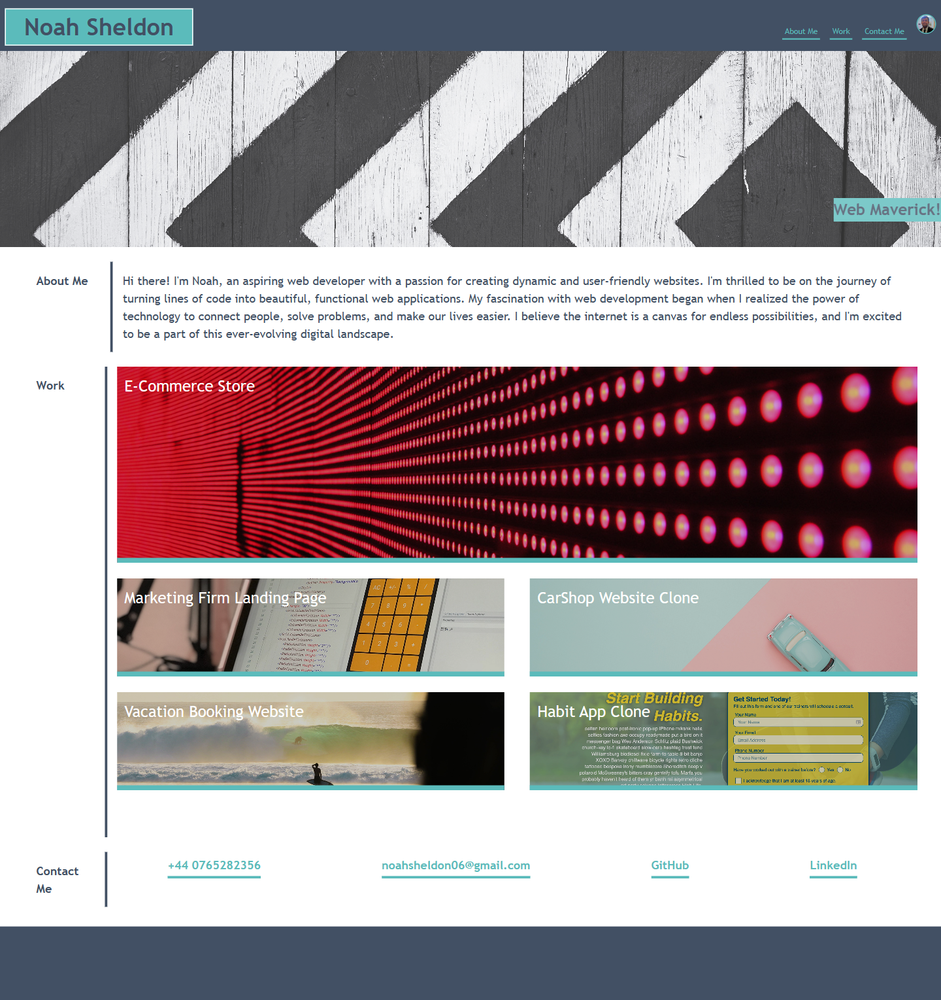
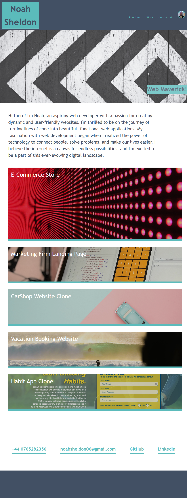
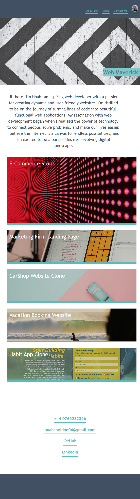

# Noah Sheldon Responsive Portfolio

## Description


Welcome to my portfolio! This project is dedicated to creating a responsive portfolio. In this README, you will find essential information about the project, instructions for setting it up, and details on how to contribute.


## Table of Contents

- [Project Overview](#project-overview)
- [Getting Started](#getting-started)
- [Landing Page](#landing-page)
- [Deployed Application](#deployed-application)
- [License](#license)


## Project Overview

The objective of this project is to create a responsive portfolio. 


## Getting Started

To initiate this project, follow these steps:

1. Clone the repository to your local machine:

   ```bash
   git clone https://github.com/noah-sheldon/responsive-portfolio.git
   ```


## Landing Page

The landing page for the application looks like the following on a standard HD screen 1920*1080 display.



The landing page for the application looks like the following on a standard HD screen 1024*800 display.



The landing page for the application looks like the following on a standard HD screen 832*624 display.



## Deployed Application

The web page for the deployed application.

[Click here](https://noah-sheldon.github.io/responsive-portfolio/)


## License

MIT License

Copyright (c) [2023] [Noah]

Permission is hereby granted, free of charge, to any person obtaining a copy
of this software and associated documentation files (the "Software"), to deal
in the Software without restriction, including without limitation the rights
to use, copy, modify, merge, publish, distribute, sublicense, and/or sell
copies of the Software, and to permit persons to whom the Software is
furnished to do so, subject to the following conditions:

The above copyright notice and this permission notice shall be included in all
copies or substantial portions of the Software.

THE SOFTWARE IS PROVIDED "AS IS", WITHOUT WARRANTY OF ANY KIND, EXPRESS OR
IMPLIED, INCLUDING BUT NOT LIMITED TO THE WARRANTIES OF MERCHANTABILITY,
FITNESS FOR A PARTICULAR PURPOSE AND NONINFRINGEMENT. IN NO EVENT SHALL THE
AUTHORS OR COPYRIGHT HOLDERS BE LIABLE FOR ANY CLAIM, DAMAGES OR OTHER
LIABILITY, WHETHER IN AN ACTION OF CONTRACT, TORT OR OTHERWISE, ARISING FROM,
OUT OF OR IN CONNECTION WITH THE SOFTWARE OR THE USE OR OTHER DEALINGS IN THE
SOFTWARE.